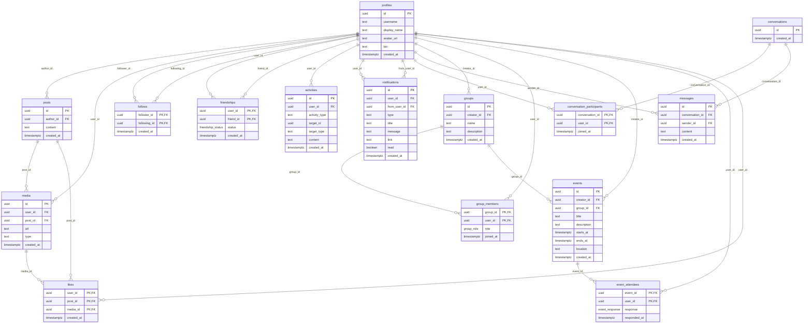

### Velvet Galaxy — Social platform for meaningful connections and local commerce

Velvet Galaxy is a modern, full‑stack social application built on Next.js. It brings together profiles, posts,
messaging, notifications, activity feeds, groups/events, media sharing, and commerce integrations (Stripe) with a focus
on performance, accessibility, and a clean developer experience.

This README helps new contributors understand the project’s purpose, architecture, technical stack, and how to install,
run, test, and deploy it from scratch. It also includes environment variables, where to get them, and common
troubleshooting steps.

---

#### Table of contents

- Objective and feature overview
- Architecture and folder structure
- Technical stack (with pros/cons and rationale)
- Prerequisites
- Environment variables and secrets (how to obtain them)
- Local development: install, run, test, lint
- Deployment (recommended: Vercel) and alternatives (Docker)
- CI/CD (example GitHub Actions)
- Troubleshooting & FAQ

---

### Objective and feature overview

Velvet Galaxy aims to:

- Connect people around shared interests and local communities
- Offer rich social features: posts, comments, likes, follows, notifications, activity feed
- Enable communication: DMs, chat rooms (WebRTC in rooms), mentions
- Facilitate communities: groups, events, and participation
- Provide media support: uploads, galleries, and viewing
- Enable basic commerce: Stripe integration and extensible monetization options

Key features present in the codebase include:

- Auth (Supabase: email/password)
- Profiles and relationships (follow, friends, relationship management)
- Posts, comments, likes, and co-authorship support
- Notifications feed (with pagination and real-time updates)
- Activity feed (live updates via Supabase real‑time)
- 3D/2D Network Visualization (galaxy-themed connection graph)
- Real-time Messaging: DMs, chat rooms (WebRTC), ephemeral media (view-once/spoilers)
- Communities: Groups, events (with RSVP), and bookmarks
- Marketplace: Stripe integration, listings, and subscriptions
- Media Management: Uploads, galleries, viewer, live capture, and multi-image support
- Search UI and Discovery
- Theming (dark/light/system)
- Performance: Client‑side caching (IndexedDB) and a Service Worker for offline support/UX
- Stripe scaffold (client and secret keys; can be extended for payments and subscriptions)

### Website structure

```text
Velvet Galaxy
├── Feed & Social
│   ├── Main Feed
│   ├── Profiles & Relationships
│   ├── Post Details & Editing
│   └── Activity Feed
├── Discovery & Network
│   ├── Galaxy Network (3D/2D)
│   ├── Search & Results
│   └── Discovery Hub
├── Communication
│   ├── Direct Messages
│   ├── Chat Rooms (WebRTC)
│   └── Notifications
├── Community
│   ├── Groups
│   ├── Events (RSVP)
│   └── Bookmarks
├── Market & Economy
│   ├── Marketplace Listings
│   └── Subscriptions (Stripe)
├── Account & Settings
│   ├── Auth (Login/Sign-up)
│   ├── Onboarding
│   ├── Settings & Verification
│   └── Help & About
└── Velvet Portal
    ├── Velvet Reviews (New)
    │   ├── Toy reviews
    │   ├── Gear guides
    │   └── Educational content
    ├── Velvet Market (New)
    │   ├── Merchandise store
    │   ├── Digital products
    │   └── Affiliate products
    └── Velvet Games (New)
        ├── Point & click adventures
        ├── Interactive stories
        └── Educational games
```

---

### Architecture and folder structure

Velvet Galaxy follows a modern, modular architecture designed for scalability, real-time interactivity, and high
performance.

#### Core Architecture

The system is built as a **Full-stack Next.js application** utilizing the **App Router** pattern. It leverages *
*Supabase** for the backend-as-a-service (BaaS) layer, providing PostgreSQL, Authentication, Real-time subscriptions,
and Edge Functions.

- **Frontend**: Next.js 16 (React 19) with Tailwind CSS 4.
- **Backend**: Next.js Route Handlers (API routes) and Supabase Edge Functions.
- **Database**: PostgreSQL (via Supabase) with Row Level Security (RLS).
- **Real-time**: Supabase Realtime (WebSockets) for feeds, notifications, and chat.
- **Media**: Supabase Storage with custom optimization and CDN delivery.
- **Payments**: Stripe integration for marketplace and subscriptions.

#### Folder Structure
This is a Next.js App Router project. Major directories at project root:

- `app/` — Next.js route handlers and pages.
  - `app/(auth)/` — Auth flows (login, signup, callback).
  - `app/activity/` — Live activity feed.
  - `app/notifications/` — Real-time notification system.
  - `app/messages/` — DM system with ephemeral media support.
  - `app/chat-rooms/` — WebRTC-enabled group chat rooms.
  - `app/network/` — 3D/2D Galaxy Network visualization.
  - `app/marketplace/` — Stripe-integrated commerce hub.
  - `app/portal/` — **Velvet Portal** (Reviews, Market, Games).
  - `app/api/` — Backend logic, webhooks, and integrations.
- `components/` — Reusable UI library.
  - `components/ui/` — Atomic design primitives (shadcn/radix).
  - `components/portal/` — Specific components for the Velvet Portal (3D toy viewers, carousels).
  - `components/network/` — Visualization logic for the Galaxy graph.
- `hooks/` — Shared logic for data fetching, auth, and device sensors.
- `lib/` — Core utilities, Supabase clients, and client-side cache (IndexedDB).
- `types/` — Project-wide TypeScript definitions.
- `sql/` — Database schema, migrations, and seed data.

---

### Technical stack — choices, pros/cons, rationale

#### Frontend Architecture

- **Framework**: Next.js 16 (React 19).
  - **Rationale**: Server Components minimize client-side JS; optimized image/font loading; standard-compliant routing.
- **Styling**: Tailwind CSS 4.
  - **Rationale**: Atomic CSS for performance and design consistency.
- **State Management**: React Context + SWR + IndexedDB.
  - **Rationale**: Local state for UI, SWR for server cache, IndexedDB for offline persistence.
- **Visualization**: Three.js / React Three Fiber (for 3D Galaxy and 3D Toy Models).
  - **Rationale**: High-performance GPU-accelerated rendering.

#### Database Design & Architecture

- **Engine**: PostgreSQL.
- **Schema Strategy**: Relational with JSONB for flexible metadata.
- **Security**: Strict **Row Level Security (RLS)** ensuring users only access data they are authorized to see.
- **Indexes**: GIN and B-Tree indexes for fast search and filtering.

#### Relational Schema



#### API Design

- **Type**: RESTful Route Handlers + Supabase Realtime.
- **Safety**: Fully typed with TypeScript; validation via Zod.
- **Performance**: Edge-runtime compatibility for low-latency responses.

#### Media Handling

- **Storage**: Supabase Storage Buckets.
- **Optimization**: Automatic resizing and WebP conversion.
- **Features**: View-once ephemeral media, spoiler blurring (CSS/Canvas), and secure private delivery.

---

### Velvet Portal

The **Velvet Portal** is the central hub for exclusive Velvet Galaxy content and services. It is designed to be a highly
interactive space for users to explore toys, games, and merchandise.

#### 1. Velvet Reviews

A comprehensive platform for sex toy reviews, providing both educational and entertainment value.

- **Features**:
  - **Interactive Media**: High-quality pictures, videos, and **3D Models** of toys.
  - **Detailed Pages**: Each toy has its own page with descriptions, technical specs, tags, and user comments/likes.
  - **Discovery**: Home page with a section description and carousels for "Newly Added" and "Most Liked" toys.
  - **Catalog**: A visual grid of toy cards with advanced search and tag filtering.
  - **Engagement**: Users can like and comment to share their experiences.

#### 2. Velvet Market

The official store for Velvet Galaxy merchandise and digital offerings.

- **Merchandise store**: Physical items produced to support the platform.
- **Digital products**: Exclusive digital content, presets, or guides.
- **Affiliate products**: Curated recommendations from trusted partners.

#### 3. Velvet Games

A collection of adult-themed games developed specifically for the platform.

- **Current Roadmap (Kinky Point & Click Ideas)**:
  - **The Keymaster's Dungeon**: Solve puzzles to progress through a BDSM dungeon using toys as tools.
  - **Pleasure Island Mystery**: A whodunit mystery with adult themes and sensual mini-games.
  - **The Toymaker's Workshop**: Craft and customize adult toys, managing resources and customer requests.
  - **Velvet Dreams**: Explore a surreal world using "pleasure energy" to transform the environment.
  - **The Forbidden Manor**: Gothic horror with kinky twists and multiple romance paths.
  - **Kink & Consequences**: A choice-driven story focusing on consent, safety, and education.
  - **The Red Room Riddle**: An immersive escape room experience with atmospheric puzzles.
  - **Sensual Spells Academy**: A magical school setting focused on intimacy and relationship building.

---

### Deployment & Operations

#### Deployment Strategy

- **Primary**: Vercel (Production & Preview environments).
- **Secondary**: Dockerized setup for self-hosting on a custom VPS or Kubernetes.

#### CI/CD Pipeline

- **Provider**: GitHub Actions.
- **Flow**:
  1. **Linting & Type Check**: Triggered on every push.
  2. **Testing**: Vitest for unit/integration tests; Playwright for E2E.
  3. **Preview**: Automatic Vercel previews for Pull Requests.
  4. **Production**: Auto-deploy to main branch after passing all checks.

#### Monitoring & Analytics

- **Performance**: Vercel Speed Insights and Core Web Vitals.
- **Errors**: Sentry for real-time error tracking and reporting.
- **Database**: Supabase Dashboard for query performance and health.

---

### Website Improvement Suggestions

To make Velvet Galaxy the ultimate platform for community and lifestyle:

1. **AI-Powered Discovery**: Implement a recommendation engine that suggests groups, events, and reviews based on user
   interests.
2. **Interactive Workshops**: Add a live-streaming component for educational sessions in the "Velvet Reviews" or "
   Community" sections.
3. **Advanced Privacy Controls**: Fine-grained visibility settings for profile attributes and activity feed items.
4. **In-App Virtual Reality (VR)**: Support for VR headsets in the 3D Galaxy Network and 3D Toy Viewer.
5. **Community Moderation Tools**: Empower group owners with advanced logging, automated filters, and role-based
   permissions.
6. **Progressive Web App (PWA) Enhancements**: Improve offline capabilities and native-like push notifications for a
   seamless mobile experience.

---

### Prerequisites

- Node.js 20 LTS (recommended). Use `nvm`, `fnm`, or Volta to pin versions.
- pnpm (recommended): `npm i -g pnpm`
- A Supabase project (free is fine) and credentials (URL + anon key).
- A Stripe account (for secret and publishable keys). You can start in test mode.

Optional:

- Vercel account (recommended hosting) or Docker runtime for self‑hosting.

---

### Environment variables and secrets

Create a `.env.local` at the project root with the following keys:

```
NEXT_PUBLIC_SUPABASE_URL=
NEXT_PUBLIC_SUPABASE_ANON_KEY=
VITE_PUBLIC_SUPABASE_URL=
VITE_PUBLIC_SUPABASE_ANON_KEY=
SUPABASE_URL=
SUPABASE_ANON_KEY=
NEXT_PUBLIC_DEV_SUPABASE_REDIRECT_URL=
STRIPE_SECRET_KEY=
NEXT_PUBLIC_STRIPE_PUBLISHABLE_KEY=
VITE_PUBLIC_STRIPE_PUBLISHABLE_KEY=
```

Where to obtain values:

- SUPABASE_URL / NEXT_PUBLIC_SUPABASE_URL
    - Supabase Dashboard → Project Settings → API → Project URL.
- SUPABASE_ANON_KEY / NEXT_PUBLIC_SUPABASE_ANON_KEY
    - Supabase Dashboard → Project Settings → API → `anon` public key.
- NEXT_PUBLIC_DEV_SUPABASE_REDIRECT_URL
    - For auth email link or redirect handling in development, set to something like
      `http://localhost:3000/auth/callback` (or the path you use). Also add this URL to Supabase Auth → URL
      Configuration → Redirect URLs.
- STRIPE_SECRET_KEY / NEXT_PUBLIC_STRIPE_PUBLISHABLE_KEY
    - Stripe Dashboard → Developers → API keys (use “test” keys in development).
- VITE_PUBLIC_* fallback keys
    - Present for compatibility with some client code. Map them to the same values as the NEXT_PUBLIC_ keys.

Security notes:

- Never commit `.env.local`.
- Production deployments should set these in the platform’s secret manager (Vercel Project Settings → Environment
  Variables).

---

### Local development

1) Install dependencies

```
pnpm install
```

2) Create `.env.local` and populate the variables above.

3) Start the dev server

```
pnpm dev
```

App runs on http://localhost:3000 by default.

4) Lint and format

```
pnpm lint
pnpm lint:fix
pnpm format
```

5) Run tests

```
pnpm test
```

End‑to‑end (if configured):

```
pnpm test:e2e
```

6) Build and run production locally

```
pnpm build
pnpm start
```

---

### Database and Auth setup (Supabase)

1) Create a Supabase project and retrieve URL + anon key.
2) Configure Auth → Email/password enabled. Add your dev callback/redirect URL(s).
3) Database: The app expects tables such as `profiles`, `notifications`, `activities`, `friendships`, `follows`,
   `posts`, `comments`, etc. If you do not have an existing schema:
    - Start with Supabase quickstart social schema examples, or
    - Define tables incrementally as you enable features (notifications and activities queries in code show expected
      columns like `created_at`, `read`, `from_user_id`, etc.).
4) RLS (Row Level Security): Enable RLS per table and add policies that allow owners to read/write their data and read
   permitted public/community data. Start with Supabase templates and tighten as needed.
5) Realtime: Ensure Realtime is enabled for tables like `activities` if you want live updates.

Tip: Keep a `sql/` folder in your fork for migrations and seed data as the project evolves.

---

### Stripe setup

1) Create a Stripe account and switch to Test mode.
2) Get your Publishable and Secret keys, add to `.env.local`.
3) If you implement webhooks, run the Stripe CLI to forward to your local server (example):

```
stripe listen --forward-to localhost:3000/api/stripe/webhook
```

4) Use test cards from Stripe docs (e.g., 4242 4242 4242 4242).

Note: The repo currently includes a basic Stripe action scaffold in `app/actions/stripe.ts`. Extend based on your
product/pricing model.

---

### Deployment (recommended: Vercel)

Vercel is the quickest way to run Next.js in production.

Steps:

1) Push your repo to GitHub.
2) Import the project into Vercel.
3) Set environment variables in Vercel Project Settings (use the same keys as `.env.local`).
4) Choose the `Production` environment and deploy.

Pros: Zero‑config for Next.js, automatic SSL, global CDN, great analytics and logs.
Cons: Platform cost at scale; some advanced networking constraints vs. a custom VPS.

#### Alternative: Docker (self‑host)

You can containerize the app. Example Dockerfile (add to your repo as needed):

```
# Dockerfile
FROM node:20-alpine AS deps
WORKDIR /app
COPY package.json pnpm-lock.yaml ./
RUN corepack enable && pnpm install --frozen-lockfile

FROM node:20-alpine AS builder
WORKDIR /app
COPY --from=deps /app/node_modules ./node_modules
COPY . .
RUN corepack enable && pnpm build

FROM node:20-alpine AS runner
WORKDIR /app
ENV NODE_ENV=production
COPY --from=builder /app/.next ./.next
COPY --from=builder /app/public ./public
COPY package.json ./package.json
COPY pnpm-lock.yaml ./pnpm-lock.yaml
RUN corepack enable && pnpm install --prod --frozen-lockfile
EXPOSE 3000
CMD ["pnpm", "start"]
```

Run locally:

```
docker build -t velvet-galaxy .
docker run --rm -p 3000:3000 --env-file .env.local velvet-galaxy
```

Ensure your environment variables are provided to the container via `--env-file` or your orchestrator.

---

### CI/CD (GitHub Actions example)

Create `.github/workflows/ci.yml`:

```
name: CI
on: [push, pull_request]
jobs:
  build:
    runs-on: ubuntu-latest
    steps:
      - uses: actions/checkout@v4
      - uses: pnpm/action-setup@v4
        with:
          version: 9
      - uses: actions/setup-node@v4
        with:
          node-version: 20
          cache: 'pnpm'
      - run: pnpm install --frozen-lockfile
      - run: pnpm lint:ci
      - run: pnpm test -- --run
      - run: pnpm build
```

You can add preview deployments via Vercel’s GitHub app.

---

### Developer guidelines

- Use pnpm. Keep dependencies up to date with `ncu -u` then test thoroughly.
- Follow ESLint and Prettier. The repo uses strict React Hook dependency rules; stabilize effect dependencies with
  `useCallback`/`useMemo`.
- Prefer TypeScript types over `any` where feasible.
- Keep keys and branding consistent (`velvet_galaxy-*` for storage/caches).

---

### Troubleshooting & FAQ

1) The page reloads too often or effects loop

- Cause: Missing dependencies in `useEffect` or unstable callback references.
- Fix: Wrap functions used by `useEffect` in `useCallback` and include them in the dependency array.

2) Supabase auth redirect/callback errors

- Ensure `NEXT_PUBLIC_DEV_SUPABASE_REDIRECT_URL` is set and the exact URL is added in Supabase Auth → Redirect URLs.
- Check that you use the correct NEXT_PUBLIC keys in the browser.

3) RLS (Row Level Security) errors (403)

- Verify RLS policies allow the intended read/write for the authenticated user.
- Temporarily test with RLS off in development to isolate policy issues (do not do this in production).

4) Stripe invalid API key or 401

- Verify `STRIPE_SECRET_KEY` and `NEXT_PUBLIC_STRIPE_PUBLISHABLE_KEY` are present and match your Stripe dashboard.
- For webhooks, ensure your CLI is forwarding events to the right path.

5) Service Worker or cache issues after deploy

- The app uses cache names starting with `velvet_galaxy-`. Invalidate by unregistering the service worker in DevTools or
  updating SW cache names.

6) TypeError: window is not defined

- Move browser‑only code into client components (`"use client"`) or guards for `typeof window !== 'undefined'`.

7) Styles not applied

- Ensure Tailwind is configured (see `postcss.config.mjs`, `styles/globals.css`) and that classes exist in the build.

8) Lint fails on warnings in CI

- Use `pnpm lint:ci` (configured with `--max-warnings=0`). Fix warnings rather than suppressing.

---

### Project status & branding

- Project name: Velvet Galaxy
- Package name: `velvet-galaxy`
- Theme and storage keys: `velvet_galaxy-*`

If you find any remaining “LinkNet” references, please open an issue or send a PR. The ongoing lint cleanup aims for 0
warnings with strict React Hooks rules.

---

### Credits

Built with Next.js, Supabase, Tailwind, Radix UI, and Stripe by the Velvet Galaxy contributors.
